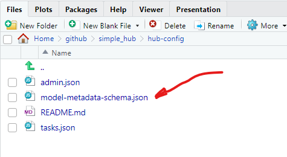
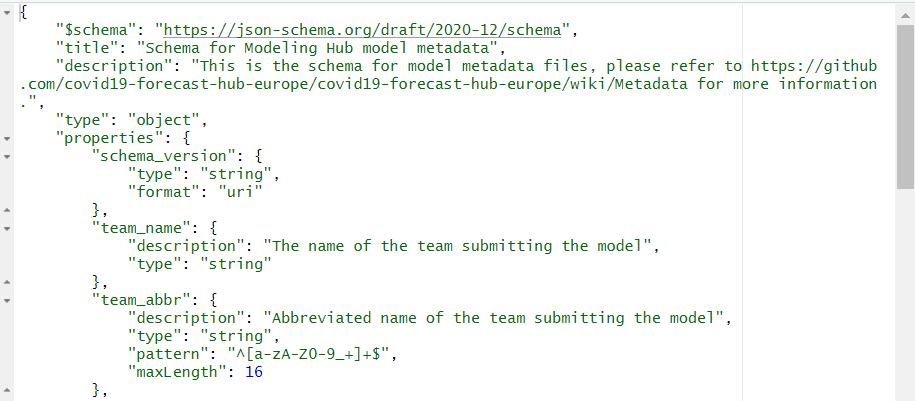
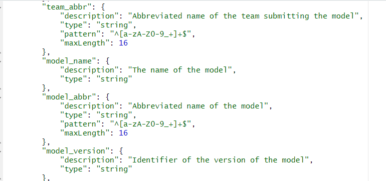

# Configuring model metadata  

For each model that is submitted to the hub, a yaml metadata file ([what is a yaml file?](https://circleci.com/blog/what-is-yaml-a-beginner-s-guide/)) must be added to the `model-metadata` directory by the modeling teams. A detailed description of the `model-metadata` directory can be found [here](../user-guide/model-metadata.md).  

Many hubs will use a common set of metadata fields. Metadata fields are defined for a hub in the `model-metadata-schema.json`, which specifies the fields that will be required for each team that submits a forecast.  

## Step 1: Open `model-metadata-schema.json`  

Check to be sure you are in the `hub-config` folder. Click on `model-metadata-schema.json` to open the file.  

  

## Step 2: Examine the `model-metadata-schema.json` file  

In your source panel (upper right hand panel), you should see the code below.  

  

If you scroll to the bottom of the file, you can see that the required fields for this schema are listed. Many hubs will use this list of metadata fields, but there are additional fields available that are described [here](../user-guide/model-metadata.md).  

  

For each metadata field, the schema defines the properties of the field. Below is the code defining the properties of the fields `team_abbr`, `model_name`, `model_abbr`, and `model_version`.

  

